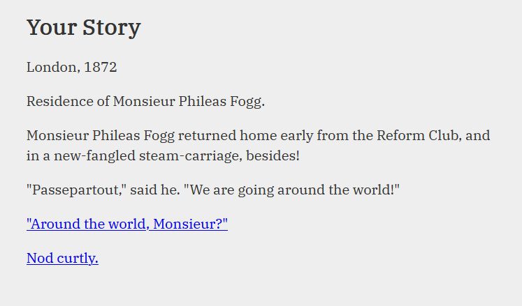

# Recycle

A template for creating interactive fiction with [ink](https://github.com/inkle/ink).



## Prerequisites

- Use this template in Github to create your new project
- Download [inklecate](https://github.com/inkle/ink/releases).
- Download [yarn](https://yarnpkg.com/).
- Install packages `yarn install`.
- Replace `./story/main.ink` with your story

## Run

View your story in the `inklecate` CLI:

```
make run
```

## Build

Build your story into JavaScript:

```
make
```

The story will be playable and distributable from `./public/index.html`.

## Distribute

Distributing a game on itch.io:

1. Build the project: `make`
2. Zip the `public/` directory and rename it, e.g. `my-game.zip`
3. Upload the game as an [HTML project in itch.io](https://itch.io/docs/creators/html5)
